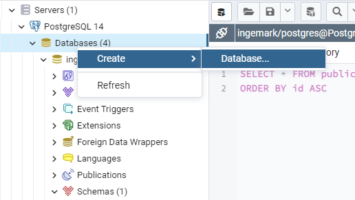
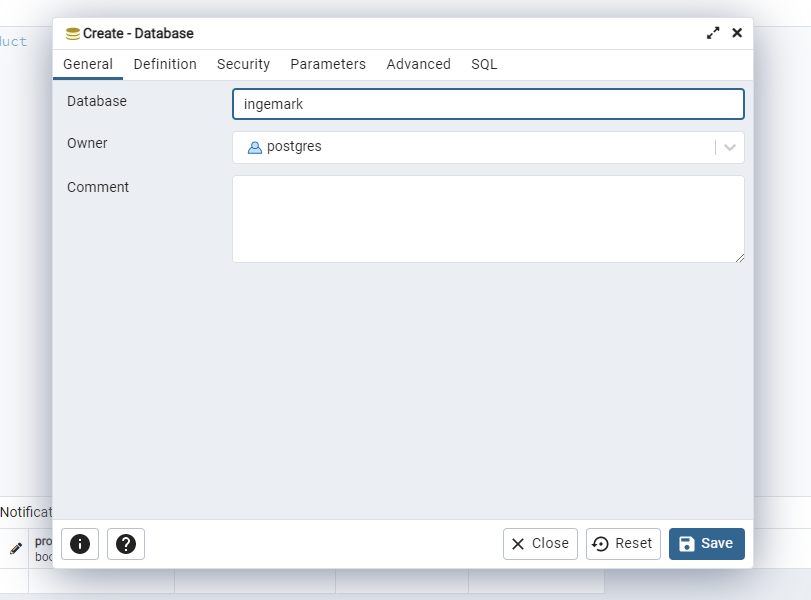

# Ingemark početni zadatak: Spring Boot REST API
Napomena: izrada aplikacije izvršena je korištenjem IntelliJ IDEA Community Edition IDE-a te PostgreSQL database managera na operacijskom sustavu Windows 11. Za maksimalnu podršku i mogućnost reprodukcije, preporuča se korištenje istog softvera.  
Poveznica na preuzimanje PostgreSQL paketa: https://www.enterprisedb.com/downloads/postgres-postgresql-downloads  
Poveznica na preuzimanje IntelliJ Community Editiona: https://www.jetbrains.com/idea/download/?section=windows

## 1. Rad aplikacije  
Aplikacija omogućuje klijentima stvaranje i pregled proizvoda.  
Svaki proizvod ima sljedeće značajke:  
- Jedinstveni ID (long)
- Jedinstveni kod (string, točno 10 znakova duljine)
- Naziv (string)
- Cijene (float, u valutama EUR i USD)
- Raspoloživost (boolean)

Klijent sam postavlja jedinstveni kod, naziv, cijenu proizvoda u valuti EUR te raspoloživost, dok sustav sam postavlja jedinstven ID te cijenu proizvoda u valuti USD.  
Baza podataka pri spremanju proizvoda automatski generira njegov ID te ga vraća sustavu.  
Cijena proizvoda u valuti USD se stvara dohvatom srednjeg tečaja pretvorbe valute EUR u USD putem HNB-ovog API-ja na dan dodavanja proizvoda koji se zatim množi s priloženom cijenom u valuti EUR.

Osim dodavanja proizvoda, klijent može i dohvatiti specifičan proizvod ili listu dostupnih proizvoda.  
U slučaju dohvata specifičnog proizvoda, klijent ga može dohvatiti putem njegovog numeričkog ID-ja ili jedinstvenog koda.  
U slučaju dohvata liste proizvoda, koristi se paginacija koja je postavljena na 20 proizvoda po stranici. Vrijednost je proizvoljno odabrana i moguće ju je mijenjati u samom HTTP zahtjevu. U slučaju dohvata liste proizvoda, oni su sortirani po njihovom numeričkom ID-ju uzlazno.  

## 2. HTTP endpointovi:
### GET  /api/product/get/code/{code} 

Dohvat proizvoda po njegovom jedinstvenom kodu.  
HTTP metoda: GET  
Path varijable: code (string, točno 10 znakova)  
Query parametri: N/A  
Mogući statusni kodovi:  
- 200 OK - Proizvod s priloženim kodom uspješno dohvaćen
- 404 Not Found - Ne postoji proizvod s priloženim kodom
- 500 Internal Server Error - Dogodila se pogreška na poslužitelju

Odgovor (200 OK):  
```
{  
  "id": 0,  
  "code": "string",  
  "name": "string",  
  "price_eur": 0.1,  
  "price_usd": 0.1,  
  "is_available": true  
} 
```

### GET  /api/product/get/id/{id}  

Dohvat proizvoda po njegovom jedinstvenom numeričkom identifikatoru.  
HTTP metoda: GET  
Path varijable: id (long)  
Query parametri: N/A  
Mogući statusni kodovi:  
- 200 OK - Proizvod s priloženim identifikatorom uspješno dohvaćen
- 404 Not Found - Ne postoji proizvod s priloženim identifikatorom
- 500 Internal Server Error - Dogodila se pogreška na poslužitelju

Odgovor (200 OK):  
```
{  
  "id": 0,  
  "code": "string",  
  "name": "string",  
  "price_eur": 0.1,  
  "price_usd": 0.1,  
  "is_available": true  
} 
```

### GET  /api/product/get/list  

Dohvat gotove liste proizvoda, uzlazno sortirane po numeričkom identifikatoru.  
HTTP metoda: GET  
Path varijable: N/A
Query parametri: page(int, stranica liste, default=0), size(int, broj elemenata po stranici, default=20)  
Mogući statusni kodovi:  
- 200 OK - Uspješno dohvaćena lista proizvoda
- 500 Internal Server Error - Dogodila se pogreška na poslužitelju

Odgovor (200 OK):  
```
[
  {
    "id": 0,
    "code": "string",
    "name": "string",
    "price_eur": 0.1,
    "price_usd": 0.1,
    "is_available": true
  }
]
```

### POST /api/product/create  

Dodavanje novog proizvoda u bazu podataka.  
HTTP metoda: POST  
Path varijable: N/A
Query parametri: N/A 
Mogući statusni kodovi:  
- 200 OK - Uspješno dodan novi proizvod
- 409 Conflict - Već postoji proizvod s priloženim jedinstvenim kodom
- 500 Internal Server Error - Dogodila se pogreška na poslužitelju

Zahtjev:
```
{
  "code": "string",
  "name": "string",
  "price_eur": 0.1,
  "is_available": true
}
```

Odgovor (200 OK):  
```
{
  "id": 0,
  "code": "string",
  "name": "string",
  "price_eur": 0.1,
  "price_usd": 0.1,
  "is_available": true
}
```

Aplikacija se lokalno pokreće na portu 8080.  
Za lakšu vizualizaciju i pokretanje HTTP endpointova, u aplikaciju je također uključen springdoc-openapi-starter-webmvc-ui dependency koji putem alata Swagger UI prikazuje generirane endpointove i nudi mogućnost njihova pokretanja u pregledniku.  
Swagger prikaz moguće je otvoriti odlaskom na sljedeću poveznicu nakon lokalnog pokretanja aplikacije:  
http://localhost:8080/swagger-ui/index.html#/

## 3. Koraci pokretanja aplikacije:
### 1) Potrebno je instalirati IntelliJ IDEA Community Edition (link u napomeni). Prilikom instalacije nije potrebno mijenjati zadane postavke instalacije.
### 2) Potrebno je instalirati PostgreSQL softverski paket (link u napomeni). Prilikom instalacije nije potrebno mijenjati zadane postavke instalacije, ali je potrebno postaviti glavno lokalno korisničko ime i lozinku na 'postgres' (obje vrijednosti). Ukoliko se koristi neka druga kombinacija korisničkog imena ili lozinke, te je promjene potrebno dodati u application.properties datoteku projekta, redom na sljedećim mjestima: spring.datasource.username, spring.datasource.password
### 3) Nakon instalacije PostgreSQL paketa, potrebno je stvoriti lokalnu bazu podataka u koju će se spremati informacije o proizvodima. Baza podataka mora se zvati 'ingemark', a baza mora biti dostupna na localhost portu 5432. Bazu je preporučeno stvoriti u alatu pgAdmin 4 koji se instalira uz ostatak paketa. Nakon otvaranja alata, potrebno je pronaći lokalni server koji osluškuje port 5432 (najčešće je to server PostgreSQL 14) i u njegove postojeće baze podataka dodati novu bazu naziva 'ingemark'.
<p align="center">
  
  
</p>

### 4) Nakon postavljanja baze podataka, dovoljno je pokrenuti aplikaciju u željenom IDE-u (preporuka: IntelliJ), bez ikakvih environment varijabli. Aplikacija će sama kreirati poveznicu s napravljenom bazom i nakon pokretanja moguće je normalno korištenje aplikacije.

Napomena: u produkcijskom okruženju varijable aplikacije nikad ne bi bile hard-coded, već bi se za to koristile environment varijable IDE-a ili bi se čitale iz .env datoteka koje ne smiju biti javno objavljene iz sigurnosnih razloga. S obzirom da se za potrebe ove aplikacije radi isključivo u lokalnom okruženju bez mogućnosti narušavanja šire sigurnosti, zbog jednostavnosti dijeljenja su iznimno ovdje varijable hard-coded.
